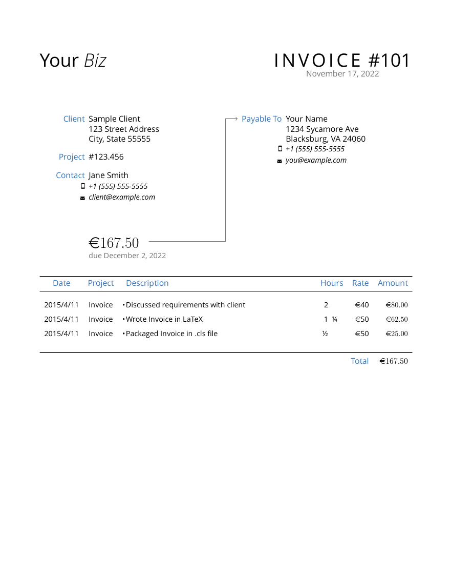

# Modern Invoice

A [Craftadoc](https://craftadoc.com) template. (Using LaTeX.)

A billable-time invoice featuring style over substance.

### How do I use this?

#### Option 1:

Directly use the template in your browser using Craftadoc [here!](https://app.craftadoc.com/template/overview/63760bbc43effab4aa2feff9) And fill in the template using the automatically generated UI. This is the easiest option.

#### Option 2:

Open the source code in Overleaf: visit [the template page](https://app.craftadoc.com/template/overview/63760bbc43effab4aa2feff9), select the gear icon in the top right and select `Open in Overleaf`.

#### Option 3:

Clone this repository and use your favorite latex compiler locally. (This template uses XeLatex.)

## Example:

## Source:
Original template:
https://github.com/mkropat/dapper-invoice

### Changes:
* Changed some commands.
* Added comments for use on app.craftadoc.com.